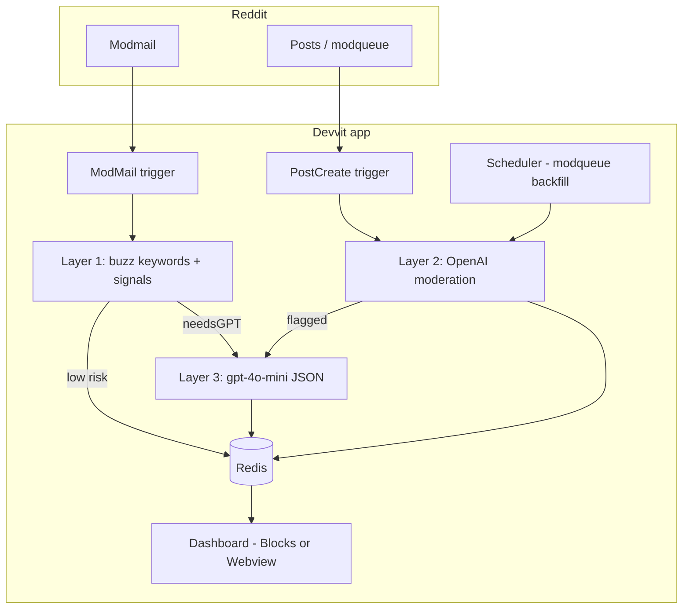

# ModShield AI — Architecture & Build Plan

AI-powered moderation shield for Reddit moderators. Screens posts and modmail, prioritizes risk, and shows **safe summaries** so mods avoid raw toxic content. Built on **Reddit Devvit** for the Mod Tools hackathon.

---

## Product summary

| Pillar | What it does |
|--------|----------------|
| **Content Shield** | Screen new posts + modqueue; flag violence, NSFW, self-harm, harassment, spam |
| **Modmail Shield** | Classify incoming modmail; summarize tone/intent; optional rule-aware auto-reply |
| **Priority Scoring** | Sort queue: Critical → Important → Review → Low → Spam |

**Core promise:** Claude/API reads harmful content — mods see summaries, tags, and actions only.

---

## Platform constraints (Devvit)

- **Hosting:** Reddit Devvit — no separate backend ([developers.reddit.com](https://developers.reddit.com))
- **Storage:** Devvit Redis (per subreddit install)
- **AI providers allowed:** **OpenAI** (`api.openai.com`) and **Gemini** only — Anthropic/Claude is **not** on the allowlist and will be denied on upload ([HTTP fetch policy](https://developers.reddit.com/docs/capabilities/server/http-fetch-policy))
- **Stack choice:** **OpenAI** — `omni-moderation-latest` + `gpt-4o-mini`

### Where ModShield lives (not inside native mod UI)

You **cannot** inject into Reddit’s built-in Mod Queue or Modmail UI. ModShield is a **companion mod tool**:

| Entry point | Behavior |
|-------------|----------|
| **Subreddit menu** | “Open ModShield Dashboard” → custom post / webview |
| **Pinned dashboard post** | Bookmark for mods |
| **Background triggers** | `ModMail`, `PostCreate`, scheduler |
| **Post menu** | “ModShield: View summary” on flagged items |
| **Install settings** | `developers.reddit.com/r/{sub}/apps/modshield-ai` |

---

## System architecture



---

## AI stack (OpenAI)

### Hybrid pipeline

| Layer | When | API / code | Purpose |
|-------|------|------------|---------|
| **1 — Local** | Every modmail message | `lib/modmailClassifier.ts` | Buzz keywords, regex, signals (instant, free) |
| **2 — Moderation** | Posts (+ modmail if high risk) | `POST /v1/moderations` (`omni-moderation-latest`) | Safety categories + scores; supports text + images; **free** |
| **3 — Chat** | Flagged content / modmail needing nuance | `gpt-4o-mini` + `response_format: json_object` | Safe summary, intent, tone, rule mapping, reply draft |

### Why not Claude-only

Original plan used `api.anthropic.com` — **not compliant** with Devvit. All production calls use `api.openai.com`.

### API key storage

```bash
devvit settings set modshield-ai --setting openaiApiKey
```

Define app-scope setting via `Devvit.addSettings` — never commit keys ([install settings](https://developers.reddit.com/docs/install_settings)).

---

## Layer 1: Modmail local classifier

Runs **before** OpenAI on every new modmail message.

### Buzz keyword buckets (defaults)

| Bucket | Examples | Tag |
|--------|----------|-----|
| Hostile | `trash mod`, `biased`, `idiot`, `corrupt` | `hostile` |
| Ban appeal | `unban`, `appeal`, `wrongfully`, `mistake` | `ban_appeal` |
| Threats | `kill yourself`, `kys` | `threat` (→ critical) |
| Spam links | `discord.gg`, `telegram`, repeated chars | `spam_pattern` |

### Signal heuristics

- **ALL CAPS** (length > 20) → `all_caps` (+15 risk)
- **Excessive `!`** (≥ 3) → `rage_punctuation`
- **Custom words** from install setting `customBuzzWords` (comma-separated)

### Output shape

```typescript
type LocalModmailResult = {
  riskScore: number;       // 0–100
  tags: string[];
  priority: "critical" | "important" | "review" | "low";
  needsGPT: boolean;       // true if risk >= 20 or ban_appeal
};
```

### Priority from local score

| riskScore | priority |
|-----------|----------|
| ≥ 70 | critical |
| ≥ 45 | important |
| ≥ 20 | review |
| < 20 | low (skip GPT unless ban_appeal) |

---

## Layer 2 & 3: OpenAI details

### Content Shield (`PostCreate` + scheduler)

1. `PostCreate` → moderation API on title + body (+ image URL if present)
2. If `flagged` or high category score → `gpt-4o-mini` for mod-safe summary
3. Redis: `post:{postId}` → JSON result
4. Scheduler (every 5 min): `subreddit.getModQueue({ type: "post" })` → backfill missed items

**Post JSON schema:**

```json
{
  "category": "safe|violence|nsfw|selfharm|harassment|spam",
  "priority": "critical|important|review|low|spam",
  "confidence": 0,
  "summary": "one sentence safe summary for mod"
}
```

### Modmail Shield (`ModMail`)

1. Trigger fires → `modMail.getConversation({ conversationId })`
2. Run **local classifier** on latest message body
3. If `needsGPT` → moderation + `gpt-4o-mini` with sub rules in system prompt
4. Redis: `mail:{conversationId}` — store **summary, tags, priority, rule** — optionally **never store raw hostile body**
5. Reply via `modMail.reply({ conversationId, body })` per shield mode

**Modmail JSON schema:**

```json
{
  "intent": "hostile_appeal|genuine_query|spam|threat|other",
  "tone": "hostile|neutral|positive",
  "priority": "critical|important|review|low",
  "action": "auto_reply|escalate_to_mod|auto_remove",
  "rule_broken": "Rule 1|Rule 2|Rule 3|Rule 4|none",
  "mod_summary": "one safe sentence for mods",
  "reply_message": "polite user-facing reply if auto_reply"
}
```

### Priority mapping (combined)

| Signals | Label |
|---------|-------|
| self-harm, threat, violence/graphic high | Critical |
| harassment, violence, hostile + high risk | Important |
| ban appeal, nsfw, ambiguous | Review |
| emotional rant, low local score | Low |
| spam patterns, repeat offender | Spam |

---

## Modmail automation modes (install settings)

| Mode | Behavior |
|------|----------|
| **full_auto** | GPT drafts reply → `modMail.reply()` immediately; mod sees safe summary in dashboard only |
| **draft** | GPT drafts reply → mod approves in dashboard → then send |
| **escalate_only** | Local + GPT classify only; mod handles all replies |

Additional settings:

- `subredditRules` — text block for GPT system prompt
- `customBuzzWords` — comma-separated extra keywords
- `enableModmailAutoReply` — boolean

---

## Devvit integration

### Scaffold

```bash
npm install -g devvit
devvit login
# https://developers.reddit.com/new → choose "Mod Tool"
devvit new modshield-ai
cd modshield-ai
```

### Permissions (`devvit.json`)

```json
{
  "permissions": {
    "reddit": { "enable": true, "scope": "moderator" },
    "http": { "enable": true, "domains": ["api.openai.com"] },
    "redis": { "enable": true }
  }
}
```

### Four hooks

| Hook | Event / job | Action |
|------|-------------|--------|
| 1 | `PostCreate` | Moderation → GPT if flagged → Redis |
| 2 | `ModMail` | Local classifier → GPT if needed → Redis → optional reply |
| 3 | `addSchedulerJob` | Poll modqueue, backfill screening |
| 4 | `addCustomPostType` + `addMenuItem` | Dashboard UI + “Open ModShield” |

### ModMail trigger (reference)

```typescript
Devvit.configure({ redditAPI: true, http: true, redis: true });

Devvit.addTrigger({
  event: "ModMail",
  onEvent: async (event, { reddit, redis }) => {
    const { conversationId, messageId } = event;
    const conv = await reddit.modMail.getConversation({ conversationId, markRead: false });
    const msgKey = messageId.split("_")[1];
    const message = conv.messages[msgKey];
    const body = message?.body ?? "";

    const local = classifyModmailLocal(body, await getCustomBuzzWords(redis));

    let result = { ...local, mod_summary: "", action: "escalate_to_mod" as const };
    if (local.needsGPT) {
      result = { ...result, ...(await analyzeModmailWithOpenAI(body)) };
    }

    await redis.set(`mail:${conversationId}`, JSON.stringify({
      summary: result.mod_summary,
      tags: local.tags,
      priority: result.priority,
      intent: result.intent,
      tone: result.tone,
      rule: result.rule_broken,
      action: result.action,
      at: Date.now(),
    }));

    const mode = await getShieldMode(redis);
    if (mode === "full_auto" && result.action === "auto_reply" && result.reply_message) {
      await reddit.modMail.reply({ conversationId, body: result.reply_message });
    }
  },
});
```

### Menu items

| Label | location | forUserType |
|-------|----------|-------------|
| Open ModShield Dashboard | `subreddit` | `moderator` |
| ModShield: View summary | `post` | `moderator` |

---

## Dashboard UI (Reddit style)

### UI approach

| Option | Use when |
|--------|----------|
| **Blocks** (MVP) | Native Reddit components, mobile + web, faster to ship |
| **Webview** (polish) | Full mockup clone — tabs, blur-on-hover, tables |

### Reddit design tokens

| Token | Value | Usage |
|-------|-------|-------|
| Orangered | `#FF4500` | Primary actions, brand |
| Background | `#1A1A1B` / `#FFFFFF` | Dark/light surfaces |
| Text | `#D7DADC` / `#1A1A1B` | Body copy |
| Critical | `#FF585B` | Badge |
| Important | `#FF8717` | Badge |
| Review | `#4FBCFF` | Badge |
| Safe | `#46D160` | Badge |

### Dashboard layout

```
┌ ModShield AI                    r/{sub}    ● N critical ┐
│ [Content queue] [Modmail] [Settings]                      │
│ Screened | Shielded | Safe | Avg response                │
├──────────────────────────────────────────────────────────┤
│ Content queue (sorted by priority)                       │
│  Post #id  u/user  [CRITICAL]  AI summary…  [Review]      │
├──────────────────────────────────────────────────────────┤
│ Modmail shield                                           │
│  Tags: Hostile appeal | Tone: hostile                    │
│  Summary only — tap to reveal raw (optional)             │
└──────────────────────────────────────────────────────────┘
```

### Blocks skeleton

```tsx
Devvit.addCustomPostType({
  name: "ModShield Dashboard",
  render: () => {
    const items = useAsync(() => loadFlaggedFromRedis());
    return (
      <vstack padding="medium" gap="medium" backgroundColor="#1A1A1B">
        <hstack alignment="space-between">
          <text size="xlarge" weight="bold" color="#FF4500">ModShield AI</text>
          <text color="#D7DADC" size="small">r/{subredditName}</text>
        </hstack>
        {/* Stats row, tabs, queue list, modmail list */}
      </vstack>
    );
  },
});
```

Blur-on-hover for flagged images: implement in **Webview** (`filter: blur(5px)` → `blur(0)` on hover).

---

## Project structure (when development starts)

```
modshield-ai/
├── devvit.json
├── package.json
├── src/
│   ├── main.tsx              # triggers, menu, custom post, scheduler
│   ├── dashboard.tsx         # Blocks UI
│   └── lib/
│       ├── modmailClassifier.ts
│       ├── openai.ts         # moderation + chat helpers
│       ├── redisKeys.ts
│       └── types.ts
└── README.md                 # Fetch Domains section for reviewers
```

---

## Redis keys

| Key | Value |
|-----|-------|
| `post:{postId}` | Shield result JSON |
| `mail:{conversationId}` | Modmail shield result (no raw body by default) |
| `dashboard:postId` | Pinned dashboard post id |
| `stats:today:{date}` | screened / shielded / safe counts |
| `settings:install` | Cached install settings (optional) |

---

## MVP scope (3-day hackathon)

| Day | Deliverables |
|-----|----------------|
| **1** | Devvit mod-tool scaffold, `PostCreate`, OpenAI moderation + Redis, basic post menu |
| **2** | `ModMail` + local classifier + GPT modmail JSON, dashboard Blocks (queue + modmail tabs) |
| **3** | Install settings (mode, buzz words, rules), Reddit styling, test sub, demo video |

### Do not build (MVP)

- User ban automation
- Full appeal workflow system
- OAuth / external auth
- Image hosting
- Embedding inside native Reddit modmail UI

### Demo moment

Side by side: toxic modmail arrives → dashboard shows **“Rule 3 — hostile ban appeal”** only → user already received calm auto-reply. Mod never read raw text.

---

## Key documentation

- [Mod tool quickstart](https://developers.reddit.com/docs/quickstart/quickstart-mod-tool)
- [Triggers (ModMail)](https://developers.reddit.com/docs/capabilities/triggers)
- [ModMailService.reply](https://developers.reddit.com/docs/api/redditapi/models/classes/ModMailService)
- [HTTP fetch + AI policy](https://developers.reddit.com/docs/capabilities/server/http-fetch-policy)
- [Install / app settings](https://developers.reddit.com/docs/install_settings)
- [Menu actions](https://developers.reddit.com/docs/capabilities/menu-actions)
- [Blocks vs Webview](https://developers.reddit.com/docs/experiences)
- Community: r/Devvit

---

## README requirement (for app review)

```markdown
## Fetch Domains

- `api.openai.com` — Content moderation (`omni-moderation-latest`) and mod-safe summaries / modmail replies (`gpt-4o-mini`).
```

Also include Terms of Service and Privacy Policy links in app details when uploading.
